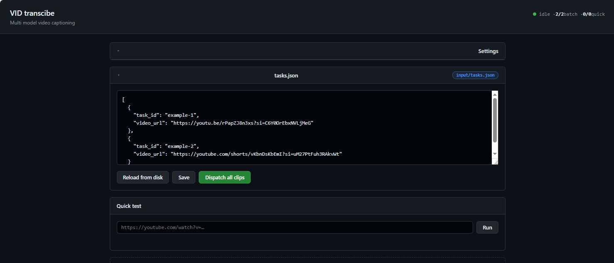

# Caption Wire

hello mate! how to use? just paste an youtube url video yes the one you shared! and it would be thinking the moment about your funny video HAHA!



# APP README

so im too lazy to write another readme, so if you use the executable please follow this:
1. **Download** of course please download the apps first from github release
2. **Install** install as ordinary apps, click it both choose place to install etc etc if you use windows 11 i reccomend turn on developer mode/idk what is it that enables install app from every source (im using win 10 dont expect anything0
3. **Running** after finished the installemnt you could check the open app in the intsallment end, or just open it, be patient if its lagging, if its open it would not always start the backend press dispatch all clips to turn on, and done you could use sample or finish the tasks.json it not always packed entirely so if you want to fill it and save it from the dashboard this is the json format:
```bash
[
  {
    "task_id": "example-1",
    "video_url": "https://youtube.com/shorts/vKbnDsKbEmI?si=uM27PtFuh3RAkvWt"
  }
]
```
task id as the name video url as video you want to transcribe

before running the engine i reccomend to go to config which there is a button in up right, enter you key such for groq and hackclub there, and press save so it would save in the backend, you could also set the ai model there, just remember to always press save after you done editing

## Why I built this

so you wonder? i build this from beest actually the idea came from my hobby as doom- oops, i mean as youtube creator, at first it for such video grading, but why not make it into this masterpiece?? its beautiful

## How it works

well its bit of complicated here especcialy if you lazy reading such as... idk my president?? but heres the story telling begin

1. **Fetch + prep** A library actually the magic library from idk maybe another american developer called ffmpeg would process your url pull frames sampled evenly accros your youtube video that you send the url with, and a whisper would transcribe the audio in a parallel, you could do some edit for frame count scales and clip length
2. **Describe** Another magic here, a vision model would see at the captured picture there also read the transcript if there is, and writes plain (just like a fresh milk from cow) factual description aboout the video this will contain no jokes or even style just a clean smooth no sarcastic no politic description about the video which would then be processed at the next LLM
3. **Draft** 3 llm model would process the plain video description and add spiciness toward them for the style that already set which is sarcastic, formal, nerd, and humble
4. **Reconcile** a model would process those spicy description from the draft and judge them just like in class when you just copy your friends homework this stage would choose the strongest draft (or in school the nerdest child) which in this case would make more accurate description instead of one model also this would either choose one or just merge the description
5. **Judge + fix** each final then would be scored for accuracy such does it match the video and is the style match so the AI would not laugh toward someone funeral video, anything below the set threshold would be sent to dagestan, just kiding it would sent back again for rewrite

There's a small dashboard ('dashboard.html', served by the FASTAPI backend) for little testing such for single url, and for batched could use 'tasks.json' do the same job just different quantity, and if you want to fix some busy code, there is an Electron wrapper, would do some bug but im too lazy to fix it.

## Tech stack

- **Python** main langguages for joining all the busyness
- **Groq** this is for uhh whisper, the most reliable one if i could say so, and some LLM work
- **Hack Club AI** for vision AI thanks for the cheap ones so i dont have to use my fireworks
- **yt-dlp / ffmpeg** download all you goofy video
- **Electron** beta work probably gonna abandoned
- **Vanilla HTML/JS** for display so i could present it in front of my parents

## Setup
yow before doing something else do this please
```bash
pip install -r requirements.txt
```

this monster Needs `ffmpeg`/`ffprobe` in your `PATH` makes sure its already on path in windows or if u using linux just use terminal its gonna be faster (probably even faster than my goverment when fixing road infrastructure)
then if there is no .env copy `.env.example` to `.env` and pour in a secret random character but in a layout for `GROQ_API_KEY` (text/judging/audio) and a cheap nice provider api key `HACKCLUB_API_KEY` for vision and you all set up!.

**apps**
dont need this tho u js need to chill

## Running it

**Dashboard:**

```bash
uvicorn api:app --reload --port 8000
```

Open `http://localhost:8000`. There's a quick test box caption etc etc js check it yourself.

**Apps:**
 click on the captioner, if not connected try with dispatch all clips button, the indicator is it connected or not is in the upper right, also in upper right there is some "settings" which from there you will able to set your api key and a lot more

Open `http://localhost:8000`. There's a quick test box caption etc etc js check it yourself.

## Config reference


| Variable | Default | What it does |
|---|---|---|
| `MIN_FRAMES` / `MAX_FRAMES` | `6` / `14` | for video sampling, place a hundred and your api bills will coming straight to you email|
| `FRAME_EVERY_SEC` | `8` | about how many frames in everyn seconds probably 30 is max (by standart 30fps video) but could be more |
| `MAX_VISION_IMAGES` | `14` | cap for images sent for vision calls dont crank it up like your parent hopes in you, cuz the provider would sent you some complain about image count|
| `USE_AUDIO` | `true` | true or false? false for no audio  |
| `VISION_MODEL` | `hackclub:anthropic/claude-opus-4.8` | read you the story anout the video |
| `TEXT_MODEL` | `hackclub:openai/gpt-5.5` | for draft and reconciling dont make me tell it again.. |
| `OPINION_MODELS` / `REASONING_MODEL` / `JUDGE_MODEL` | text model representative.. |
| `JUDGE_FALLBACK_MODEL` | `groq:openai/gpt-oss-20b` | the second chance.. just like representative of president, for judging |
| `JUDGE_THRESHOLD` | `0.7` | GRADE! minimum grade to pass just dont make it asian minimum A+ grade |
| `MAX_PARALLEL_VIDEOS` | `4` | max video processed in a time |

rate limits: YOW DONT SET IT SO HIGH i know you want to mass produce but this is not a ford factory because each time video processed, it would call groq and hackclub provider, just make sure dont make it timeout

## Project layout

- `main.py` main pipeline, all the work is processed here
- `mdr.py`, `gc.py`, `hcc.py` hello is prrovider here? yea this thing calls for the model
- `api.py` / `server.py` backend dude
- `index.html` main view! not really pretty atleast it work

## Notes

HELLO! hei if you read this i know this is off context but i want to explain 3 things:
- first this thing is much more about 1 days programming 8 days debugging and refactoring while reading documentation for phyton
- second AI usage is clear here u can see in the HTML one its using AI for much more refactoring there more in javascript (the most hardest langguage if i could say) is it count as 30%? idk
- third enjoy this hatred project please, im not really into html java and css before (im more about making automation for my youtube things) so enjoy please

---
---
